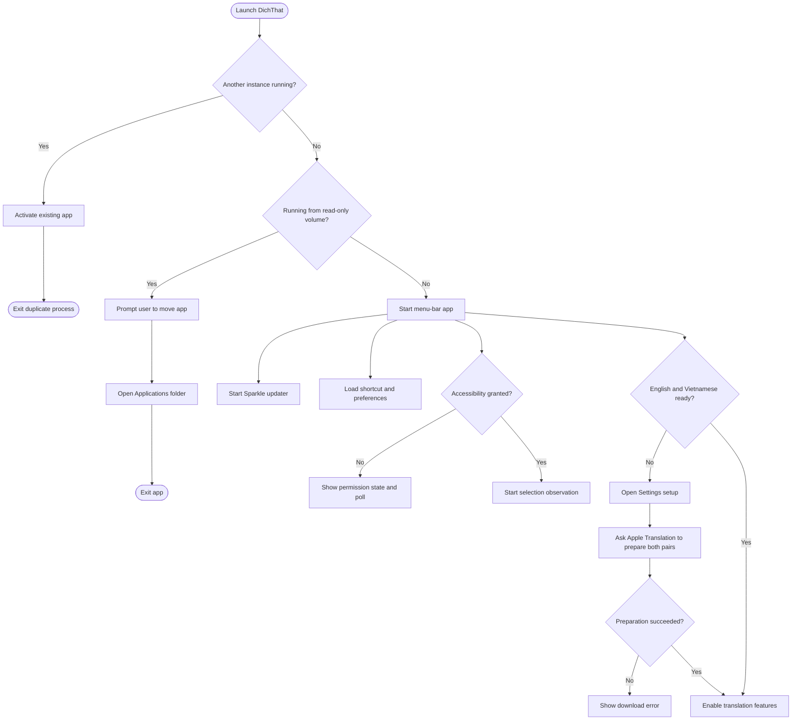
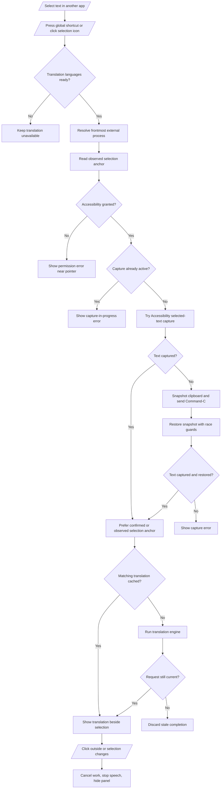
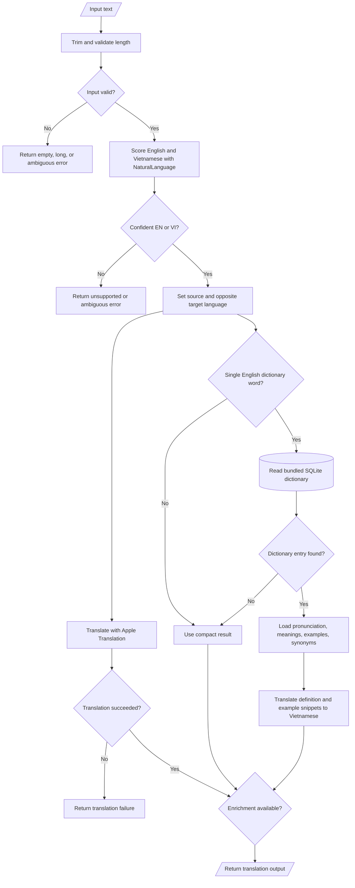
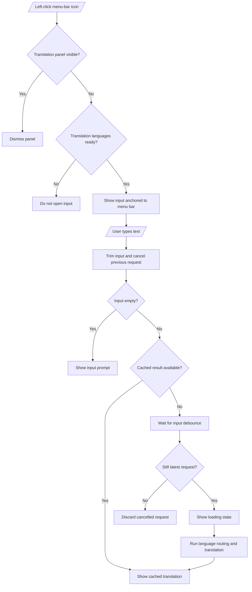
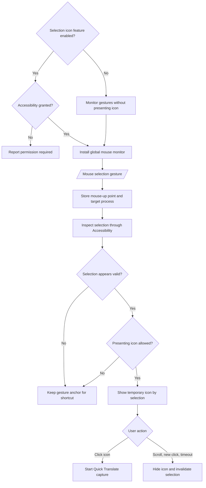
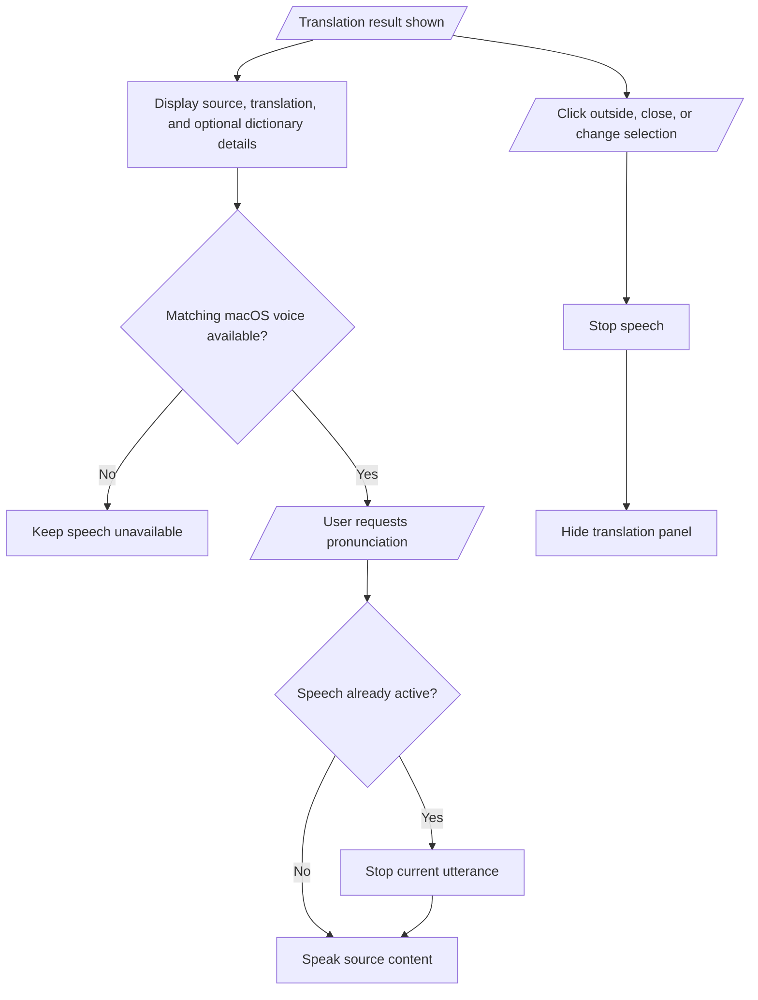
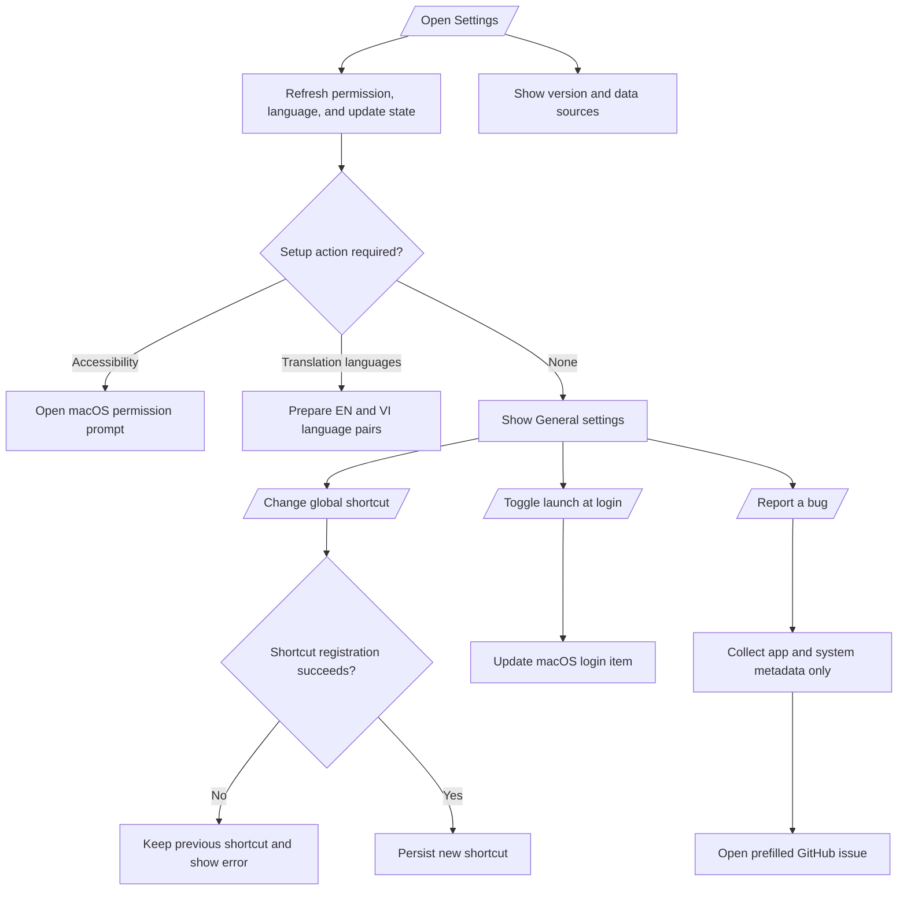
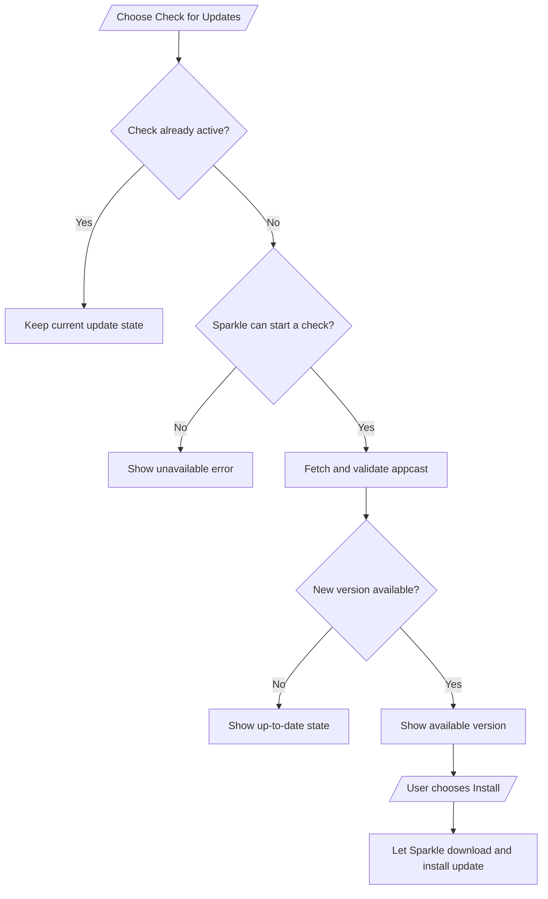
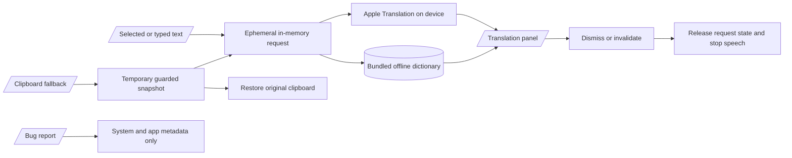

# DichThat feature flows

This Mermaid Diagram Document describes the implemented product flows in the current source. Each diagram stays focused enough to review independently while sharing the same feature boundaries.

## 1. Launch and first-run setup

## 2. Quick Translate from selected text

## 3. Language routing and translation enrichment

## 4. Direct input from the menu bar

Right-clicking the menu-bar icon opens the command menu for permission setup, update checks, Settings, and Quit. Before language preparation completes, the menu exposes only Settings and Quit.

## 5. Selection observation and optional icon

The selection-icon UI is currently disabled by `AppConfiguration.Features.selectionIconEnabled`. Gesture observation remains useful because it preserves the selection endpoint for accurate popup placement.

## 6. Translation result actions

## 7. Settings and system integrations

## 8. Update flow

## 9. Data and privacy boundary

DichThat does not persist translation history, selected text, or clipboard contents, and it does not include that content in diagnostics. The clipboard path is a fallback used only when Accessibility capture cannot return selected text.
