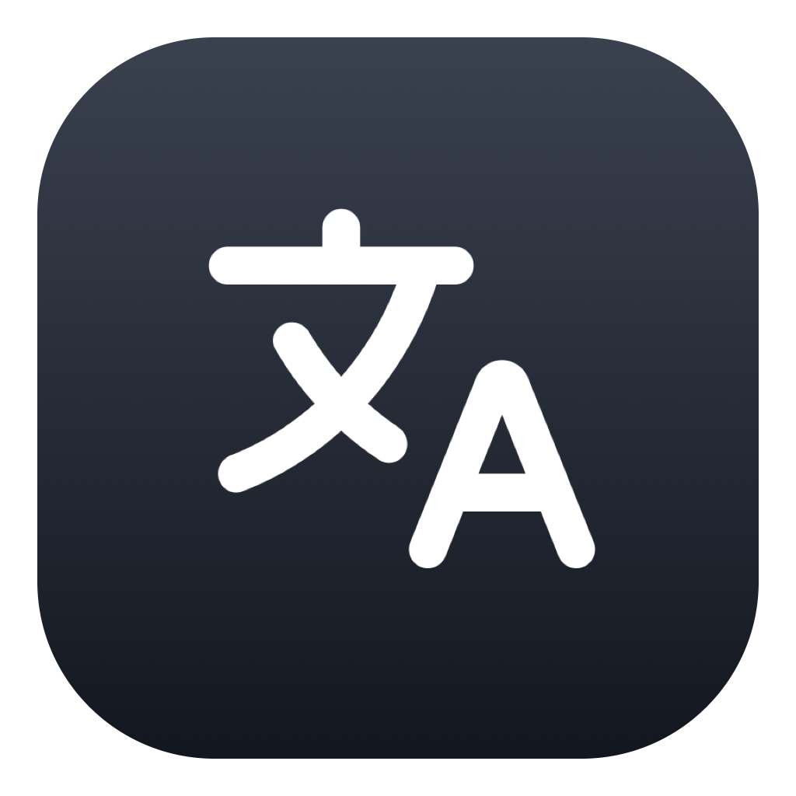

<p align="center">
  
</p>

<h1 align="center">DichThat</h1>

<p align="center">
  Dịch nhanh tiếng Anh ↔ tiếng Việt ngay tại nơi bạn đang đọc trên macOS.
</p>

<p align="center">
  <a href="README.md"><strong>Tiếng Việt</strong></a> ·
  <a href="README.en.md">English</a>
</p>

<p align="center">
  
  
  
  
  <a href="https://github.com/hgthaii/dichthat/actions/workflows/release.yml"></a>
</p>

## Giới thiệu

DichThat là ứng dụng nhỏ nằm trên menu bar của macOS. Bạn chỉ cần chọn một đoạn chữ, nhấn phím tắt và xem bản dịch ngay bên cạnh — không cần chuyển sang ứng dụng khác.

Ứng dụng tự nhận biết tiếng Anh hoặc tiếng Việt và dịch sang ngôn ngữ còn lại.
Bản phát hành hỗ trợ máy Mac dùng chip Apple và các máy Mac Intel tương thích với macOS 26 trở lên.

## Tính năng chính

- Dịch nhanh chữ đang chọn bằng phím tắt tuỳ chỉnh.
- Nhập từ hoặc câu trực tiếp từ menu bar.
- Hiển thị phiên âm, nghĩa, ví dụ và từ đồng nghĩa cho từ tiếng Anh.
- Phát âm nội dung bằng giọng đọc của macOS.
- Tự khởi động khi đăng nhập nếu bạn muốn.
- Tự tải và cài đặt bản cập nhật mới ngay trong ứng dụng.
- Giao diện gọn nhẹ, hỗ trợ cả Light Mode và Dark Mode.

## Cách sử dụng

1. Mở file DMG, kéo DichThat vào **Applications**, rồi mở app tại đó.
2. Nếu macOS chặn lần đầu, vào **Privacy & Security → Open Anyway**.
3. Cấp quyền **Accessibility** theo hướng dẫn trong Settings.
4. Lần đầu mở app, tải tiếng Anh và tiếng Việt theo hướng dẫn trong Settings để bật tính năng dịch. Trước khi tải xong, app chỉ cho phép mở Settings hoặc thoát.
5. Chọn chữ tiếng Anh hoặc tiếng Việt và nhấn phím tắt mặc định `⌃⌥T`.
6. Bản dịch sẽ xuất hiện cạnh đoạn chữ vừa chọn.

Bạn cũng có thể click icon DichThat trên menu bar rồi nhập nội dung cần dịch.

## Quyền riêng tư

- DichThat không lưu lịch sử dịch.
- Ứng dụng không ghi lại nội dung bạn chọn hoặc clipboard.
- Nội dung cần dịch được Apple Translation xử lý ngay trên máy.
- Nghĩa, ví dụ, từ đồng nghĩa và phiên âm US được tra từ bộ dữ liệu tích hợp sẵn; không gửi từ cần tra tới dịch vụ từ điển.
- Báo lỗi chỉ kèm thông tin hệ thống cần thiết, không kèm nội dung bạn đã dịch.

Nguồn dữ liệu từ điển: Open English WordNet 2025 và CMU Pronouncing Dictionary. Xem đầy đủ tại **Settings → About → Nguồn dữ liệu**.

## Báo lỗi

Mở **Settings → About → Report a Bug** để tạo báo lỗi có sẵn thông tin hỗ trợ, hoặc truy cập [GitHub Issues](https://github.com/hgthaii/dichthat/issues).

## Dành cho nhà phát triển

Yêu cầu macOS 26 trở lên và Swift 6.

```bash
swift test
bash scripts/build-offline-dictionary.sh # chỉ cần khi cập nhật nguồn dữ liệu
bash scripts/app.sh build-and-verify
bash scripts/build-dmg.sh
```

App nằm tại `/private/tmp/dichthat-app/DichThat.app`; DMG nằm trong `dist/`.

Xem [cây thư mục dự án](PROJECT_STRUCTURE.md) và [sơ đồ luồng tính năng](MDD.md) để hiểu nhanh kiến trúc source code.

## Đóng góp

Issue và pull request đều được chào đón. Hãy đọc [hướng dẫn đóng góp](CONTRIBUTING.md), giữ thay đổi tập trung, không đưa nội dung người dùng vào log hoặc test fixture, đồng thời chạy `swift test` và các lệnh build liên quan trước khi gửi pull request.

Nếu phát hiện lỗ hổng bảo mật, vui lòng làm theo [chính sách bảo mật](SECURITY.md) thay vì mở issue công khai.

## Giấy phép

DichThat được phát hành theo [MIT License](LICENSE).

## Mời mình một ly cà phê

Nếu DichThat hữu ích với bạn, hãy ủng hộ mình một ly cà phê nhé:

[☕ Buy me a coffee](https://www.buymeacoffee.com/hgthaii)
